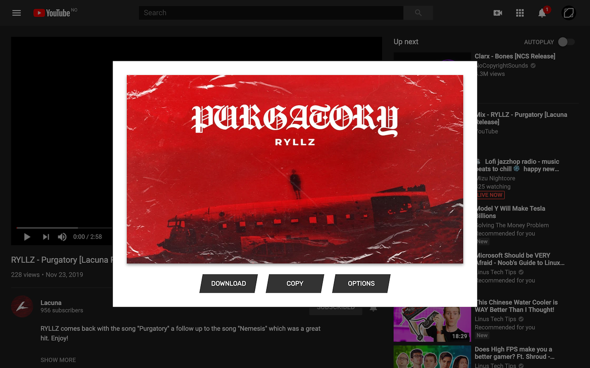

	

<h1 align="center" style="margin-top:0px">
	Thumbnail Grabber
</h1>

Chrome extension for grabbing thumbnails/covers from YouTube, SoundCloud, Spotify and YouTube Music.

	
	

 

Easily download/copy/open thumbnails and covers from YouTube, SoundCloud, Spotify, YouTube Music and more. Get the [Chrome extension](https://chrome.google.com/webstore/detail/thumbnail-grabber/gbpjnjieenljpncojgiboejmolbihdob) or [Firefox extension](https://addons.mozilla.org/en-US/firefox/addon/thumbnail-grabber).

You can click the extension icon, use keyboard shortcuts or right click the page or links. You can customize the keyboard shortcuts, what clicking the extension icon does, and what context menu items are visible.

## Dev Instructions

### Setup
1. Install Node.js
2. Run `npm install` to install dependencies

### Commands
- `npm run dev`: Build extension and watch for changes
- `npm run build`: Build extension and create a zip in `/dist`, ready for distribution to stores
- `npm run format`: Format code and apply code suggestions
- `npm run check`: Check code

## Permissions
- `scripting`: For finding & displaying thumbnails
- `storage`: For storing the extension's settings
- `contextMenus`: For the ability to open/copy/download from the right-click menu
- `activeTab`: For inserting the popup into the current website
- `clipboardWrite`: For copying thumbnails to the clipboard
- `<all_urls>`: For checking if a thumbnail URL exists
- Individual URLs: For showing the download popup on certain websites

### Publish new version
1. Run `npm run check`
2. Update `CHANGELOG.md`
3. Update version in `package.json`
4. Run `npm run build`
5. Commit with a tag in format "v#.#.#"
6. Create GitHub release with the extension zip and release notes
7. Publish to Chrome and Firefox stores
